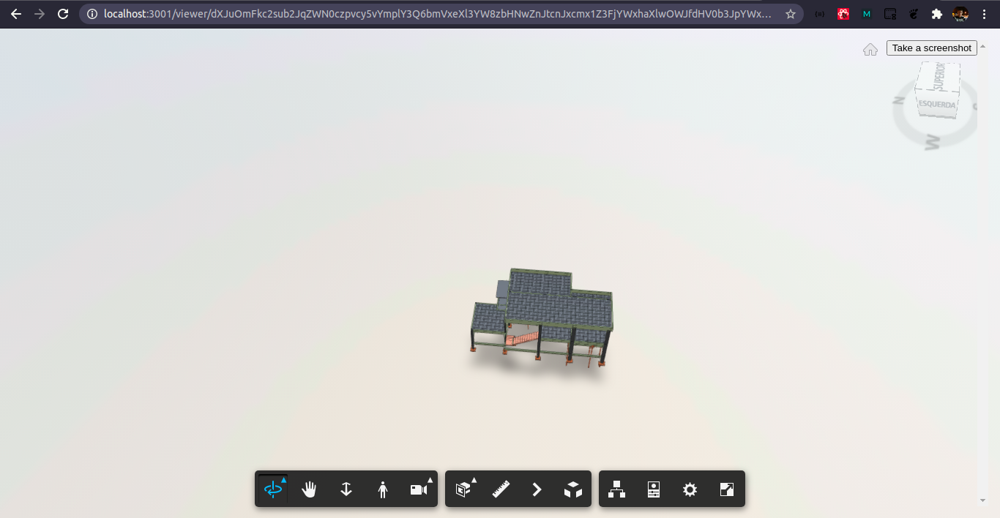

# Viewer Autodesk Simple

Aplicação simple utilizando a API da Autodesk, onde é possível carregar seu modelo 3D ou 2D e visualiza-lo.

## Screenshot

## Development

### Prerequisites

- [Registre uma aplicação no Autodesk](https://forge.autodesk.com/en/docs/oauth/v2/tutorials/create-app)
- [Node.js](https://nodejs.org)
- Terminal (por exemplo, [Windows Command Prompt](https://en.wikipedia.org/wiki/Cmd.exe)
  ou [macOS Terminal](https://support.apple.com/guide/terminal/welcome/mac))

### Setup & Run

- Clone o repositório
- Instale as dependências: `npm install`
- Configure as variáveis de ambiente:
  - `FORGE_CLIENT_ID` - Seu Client Id da aplicação Forge
  - `FORGE_CLIENT_SECRET` - Seu Secret Id da aplicação Forge
  - `FORGE_BUCKET` (optional) - Nome do Forge Bucket
- Rode o servidor: `npm start`
